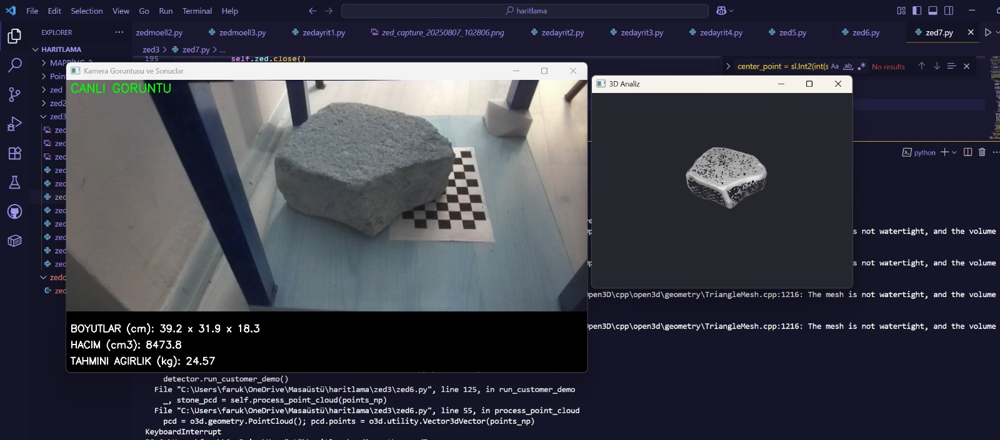

# ZED & RealSense 3D Vision Projects

Bu repo, **Intel RealSense** ve **Stereolabs ZED** derinlik kameraları kullanılarak geliştirilmiş çeşitli bilgisayarlı görü (computer vision), 3D modelleme ve ölçüm projelerini içerir.

Proje, kullanılan donanım ve amaca göre 4 ana bölüme ayrılmıştır:

## 📂 Proje Listesi

# ZED Camera Object Detection and Modeling

This project provides a comprehensive suite of tools for working with the ZED Stereo Camera. It includes modules for object detection, 3D modeling, depth sensing, spatial mapping, and specific industrial applications like stone measurement.

## 🎯 Core Purpose

The fundamental goal of this project is to leverage the **ZED 2i stereo camera** alongside various advanced algorithms—including **YOLOv8** for object detection, **Point Cloud** processing for 3D reconstruction, and **Voxel Grid** analysis for volumetric estimation—to accurately distinguish objects from their environment. We aim to precisely estimate their dimensions and iteratively improve the accuracy of these measurements.




## 📂 Project Structure

The project is organized into several key directories, each serving a specific purpose. Click on the links below to view detailed documentation for each module:

- **[`pythonzed/`](pythonzed/README.md)**: Contains core scripts for fundamental ZED camera operations such as depth sensing, point cloud generation, hand tracking, and basic measurements.
- **`haritlama/`**: A collection of advanced modules for mapping and specific use cases.
    - **[`zed/` (Object Detection)](haritlama/zed/README.md)**: Focuses on object detection integration (using YOLOv8) and various experimental ZED scripts.
    - **[`zed2/` (3D Modeling)](haritlama/zed2/README.md)**: Dedicated to 3D object scanning, modeling, and precise measurements.
    - **[`zed3/` (Stone Analysis)](haritlama/zed3/README.md)**: A specialized module for industrial stone measurement, cutting plan generation, and detailed analysis.


## ✨ Key Features

- **Object Detection**: Real-time object detection using YOLOv8 integrated with ZED depth data.
- **3D Modeling**: Generate 3D meshes and point clouds of scanned objects.
- **Depth Sensing**: Utilize the ZED camera's stereo vision for accurate depth estimation.
- **Spatial Mapping**: Create maps of the environment for navigation or analysis.
- **Measurement Tools**: Precise tools for measuring distances, dimensions, and volumes of objects.
- **Industrial Application**: Specialized scripts for stone measurement and cutting optimization.

## 🚀 Getting Started

### Prerequisites

- **ZED SDK**: Ensure the ZED SDK is installed and configured for your ZED camera.
- **Python 3.x**: The project is built using Python.
- **Dependencies**: Install the required Python libraries (e.g., `pyzed`, `opencv-python`, `ultralytics`, `open3d`, `numpy`).

```bash
pip install numpy opencv-python pyzed-sl ultralytics open3d
```

### Installation

1.  Clone the repository:
    ```bash
    git clone https://github.com/farukdnc27/zed-cam-object-deteciton-and-modelling.git
    ```
2.  Navigate to the project directory:
    ```bash
    cd zed-cam-object-deteciton-and-modelling
    ```


