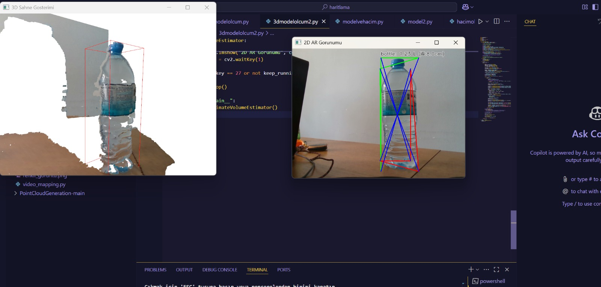

# ZED 3D Modeling & Scanning (`haritlama/zed2`)

This module is dedicated to 3D scanning and modeling using the ZED camera. It allows you to capture the geometry of objects and environments, saving them as 3D mesh files (e.g., `.obj`, `.ply`).




## 📂 Key Files & Directories

- **`zedmodel.py` / `zedmodel2.py`**: Scripts for initiating the spatial mapping process and generating 3D meshes.
- **`zedolcum.py`**: A tool for performing measurements on the live camera feed or generated models.
- **`created_models/`**: Directory where raw generated models are saved.
- **`final_models/`**: Directory for processed or finalized 3D models.
- **`3d_model.obj`**: An example output of a 3D scan.

## ✨ Features

- **Spatial Mapping**: Uses ZED's SLAM capabilities to map the environment in real-time.
- **Mesh Generation**: Converts the spatial map into a textured or untextured 3D mesh.
- **Export Formats**: Supports exporting models to standard formats like OBJ and PLY.
- **Measurement**: Tools to measure distances on the scanned objects.

## 🚀 Usage

To start a scanning session:

```bash
python zedmodel2.py
```

Follow the on-screen instructions (usually moving the camera around the object) to complete the scan.

## 📸 Examples

### Scanned Object

*Screenshot of a 3D model viewed in a mesh viewer.*

## ⚠️ Tips for Better Scans

- **Lighting**: Ensure consistent and adequate lighting. Avoid direct sunlight or very dark shadows.
- **Movement**: Move the camera slowly and steadily around the object.
- **Texture**: Objects with rich textures scan better than plain, uniform surfaces.
