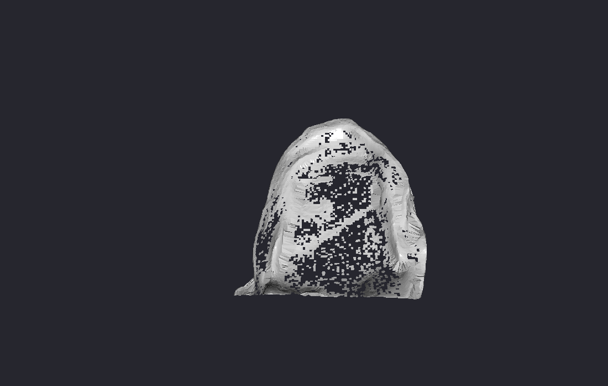

# Industrial Stone Analysis & Cutting Plan (`haritlama/zed3`)

This advanced module is designed for a specific industrial application: analyzing natural stones (or similar irregular objects) to optimize cutting plans. It uses voxel-based analysis to determine the best way to fit standard sizes into the irregular shape of the stone.




## 📂 Key Files

- **`zedtasolcum12.py`**: The most advanced version of the stone measurement and analysis script. It likely includes the full pipeline from scanning to plan generation.
- **`zedtasolcum.py` - `zedtasolcum11.py`**: Previous iterations of the algorithm.
- **`cut_plan_*.csv`**: Output files containing the calculated cutting plans.
- **`zed_capture_*.png`**: Snapshots taken during the analysis process.

## ✨ Features

- **Voxelization**: Converts the 3D scan of the stone into a voxel grid for volumetric analysis.
- **Envelope Calculation**: Determines the maximum inner rectangular volume (envelope) that fits within the irregular stone.
- **Cutting Optimization**: Algorithms to calculate the optimal cutting plan to maximize yield and minimize waste.
- **Reporting**: Generates CSV reports detailing the dimensions and positions of the cuts.

## 🚀 Usage

Run the main analysis script:

```bash
python zedtasolcum12.py
```

The script will process the camera input (or a loaded file), analyze the object, and output the results.

## 📸 Examples

### Cutting Plan Visualization

*Screenshot showing the calculated cutting lines on the stone's 3D model.*

## ⚠️ Requirements

- This module may require higher computational resources due to voxel processing.
- Specific calibration might be needed for accurate metric measurements.
