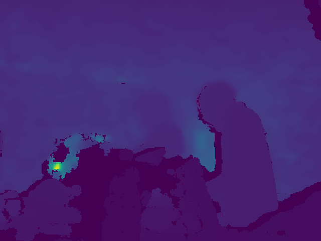

# Core ZED Scripts (`pythonzed`)

This directory contains a collection of fundamental Python scripts for interacting with the ZED Stereo Camera. These scripts demonstrate basic capabilities such as depth sensing, point cloud generation, hand tracking, and basic measurements.




## 📂 File Descriptions

Here is a breakdown of the key scripts in this directory:

- **`derinlik.py`**: Displays the depth map from the ZED camera in real-time. Useful for visualizing distance information.
- **`modelleme.py`**: Captures and displays a 3D point cloud of the scene.
- **`olcum.py` / `olcum2.py`**: Tools for measuring distances between points in the 3D space.
- **`handflow.py`**: Demonstrates hand tracking capabilities (if supported by the SDK/model used).
- **`haritalama.py`**: Performs spatial mapping to create a 3D map of the environment.
- **`sanalduvar.py`**: Implements a "virtual wall" concept, likely for detecting objects crossing a specific depth threshold.
- **`renk.py`**: Basic color image capture and processing.

## 🚀 Usage

To run any of these scripts, simply execute them with Python. Make sure your ZED camera is connected.

```bash
python derinlik.py
```

```bash
python modelleme.py
```

## 📸 Examples

### Depth Sensing (`derinlik.py`)

*Screenshot of the depth map output.*

### 3D Point Cloud (`modelleme.py`)

*Screenshot of the 3D point cloud viewer.*

## ⚠️ Requirements

- ZED SDK
- `pyzed` Python wrapper
- `opencv-python`
- `open3d` (for some visualization scripts)
